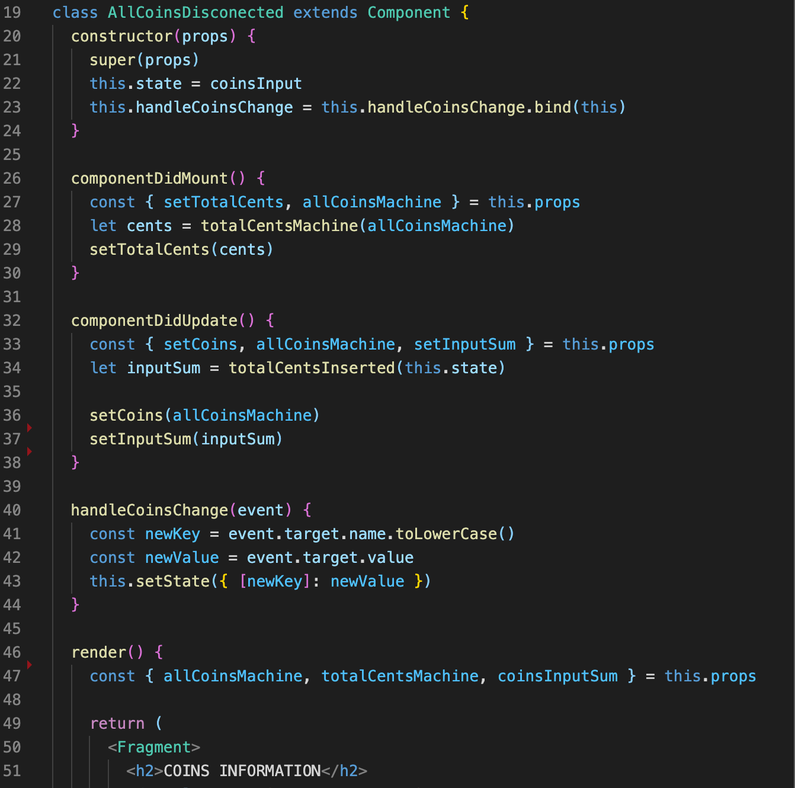
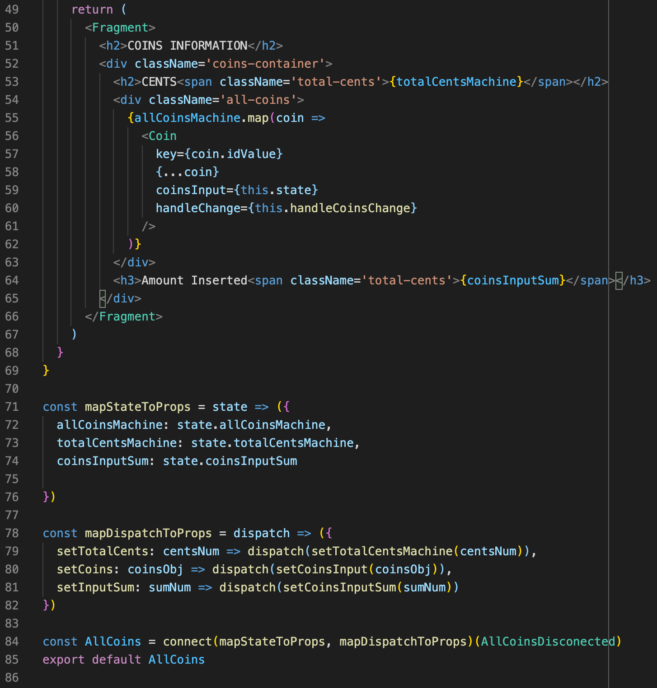
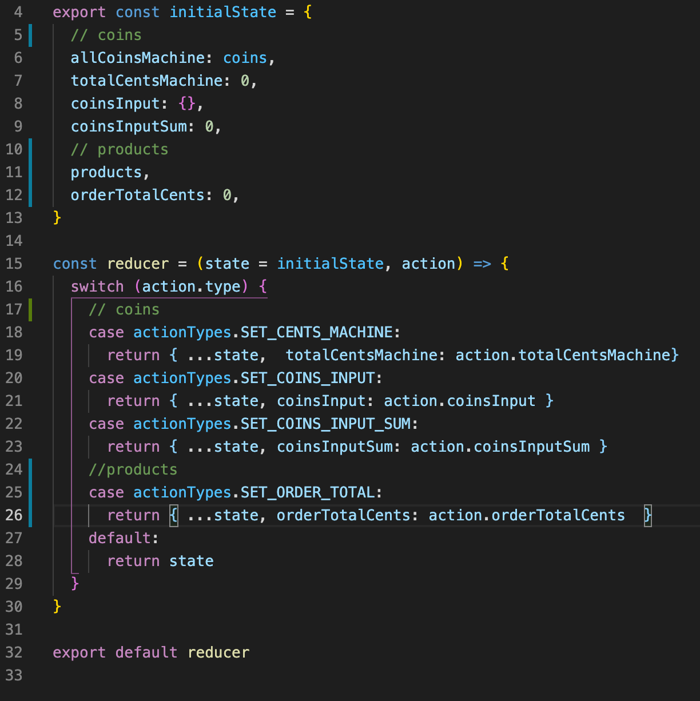
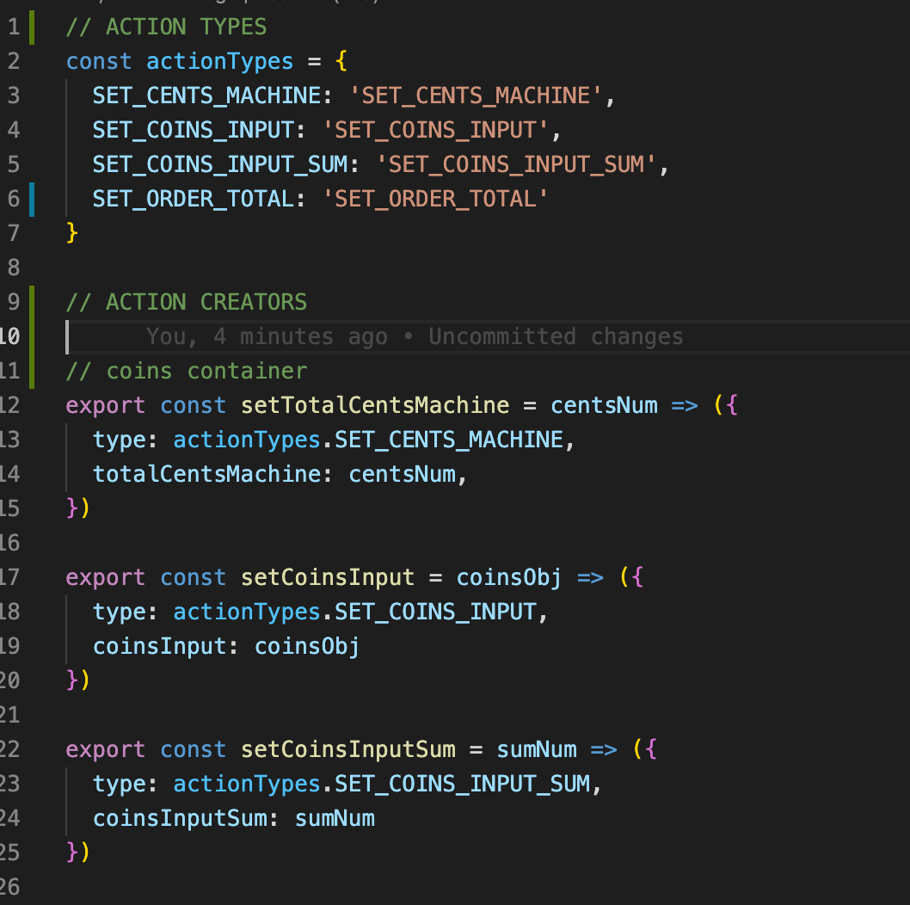
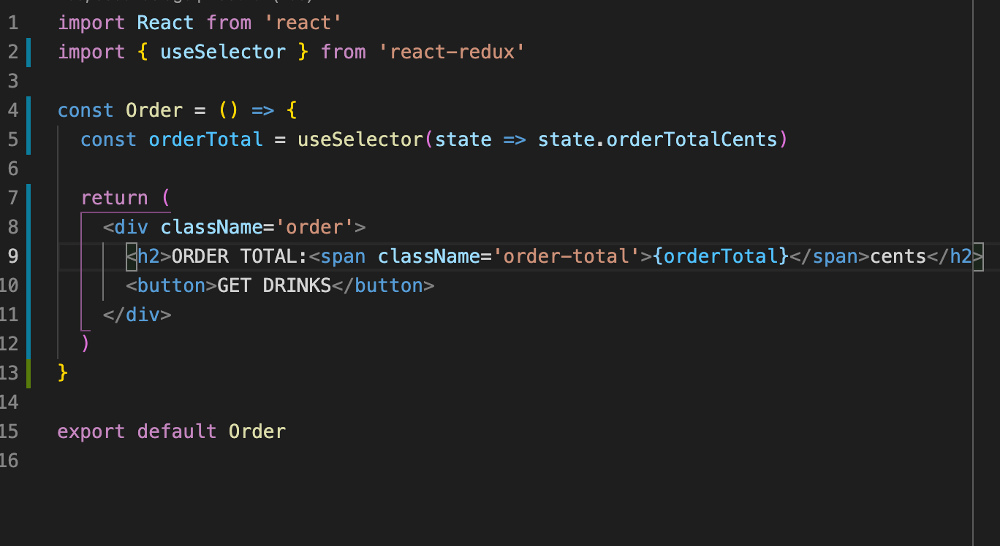

# Drinks Machine Program (GreenSlate Coding Challenge)

## Attn GreenSlate engineering team!

Thank you for giving me an opportunity to participate in this coding challenge. 
However, I have not implemented some assessment requirements due to a lack of time. 
I had part-time work to do. 
I would appreciate 1 or 2 extra days to complete an assessment.

  
  

  
  

  

## Setup

### MacOS/Linux

- `npm install`
- `npm start`

### Windows

- `npm install`
- `npm run build-watch` to start the webpack process
- Open another terminal window; from there, `npm run start-server` to start the server process
